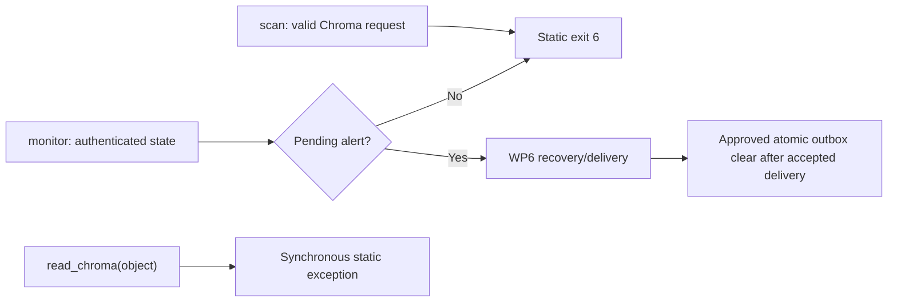

# Architecture

**Baseline:** WP7A is implemented from Git commit
`e9fdbbe456386b052f35de2c180901275aa6747c`. This security change requires independent review
before merge. It is not a stability, production-readiness, connector-completeness, or compliance
guarantee.

## Implemented now

RAGLeakGuard is a local Python package and CLI. No source-scanning connector is currently
available. The exposed Chroma entry points are explicit fail-closed boundaries:

Detection, risk-policy, report construction, authenticated monitor-state, and protocol-v2 webhook
modules remain importable. A separately versioned stable Python SDK contract is not defined.

### Disabled Chroma boundary

[connectors.py](../src/ragleakguard/connectors.py) defines the public
`ChromaConnectorUnavailableError`, the one static disabled message, and a non-generator
`read_chroma()` function. Invocation raises synchronously before Chroma import, path coercion or
inspection, filesystem access, detector initialization, or client construction. It returns no
iterator or scan session.

For `scan`, Typer performs ordinary option parsing, and RAGLeakGuard preserves source/path and locale
usage validation. A valid Chroma new-scan request then exits 6 before detection, source access,
report construction or replacement, and success output.

For `monitor`, source/path and locale usage validation is followed by existing webhook configuration,
monitor-key, state, and scope authentication. A valid pending alert retains WP6 precedence and is
recovered without a new scan. When there is no pending alert, execution exits 6 before detection,
Chroma import, source access, scan-derived state changes, pending-alert creation, webhook request
preparation, or success output.

This preserves existing report and state bytes on disabled paths, leaves absent artifacts absent,
and creates no temporary artifact. The Chroma runtime dependency is not present in package metadata.

### Evidence and decision boundary

Executable endpoint evidence established durable mutation with ChromaDB 1.5.0 and 1.5.9: approved
local Rust-client construction could append a durable `acquire_write` row, including on migration
validation failure, and successful reads could change hashes of opaque durable segment files. Other
versions have not established an acceptable read-only boundary.

[Issue #15](https://github.com/Agenvana/RAGLeakGuard/issues/15) was deferred as `not planned`; it
was not completed. Snapshot-backed support is under a separate feasibility and security review and
is unavailable. No supported Chroma range or future activation is implied.

### Detection and risk reports

[detect.py](../src/ragleakguard/detect.py) contains the Presidio/spaCy detector. Default library use
requests global/US types; `au` is the only implemented opt-in locale pack. Findings may contain raw
detected text in process, so importing callers are responsible for protecting it. Disabled CLI paths
do not initialize detection.

[risk_policy.py](../src/ragleakguard/risk_policy.py) implements `RLG-ID-RISK@1.0.0`.
[report.py](../src/ragleakguard/report.py) can build deterministic aggregate Markdown reports, but
disabled new-scan CLI paths never invoke or write one. Historical reports remain unversioned when
they lack explicit policy attribution.

### Monitor state and pending-alert recovery

[monitor.py](../src/ragleakguard/monitor.py) retains the authenticated version-3 checkpoint and its
one-entry privacy-minimal pending-alert outbox. Key/scope/state validation still precedes new-scan
disablement. Pending recovery uses the same stable delivery ID with fresh attempt authentication,
bounded retry metadata, HTTPS-only no-redirect transport, and static privacy-safe failure messages.

Only accepted `2xx` response headers permit the approved authenticated atomic transition from an
existing pending alert to `pending_alert: null`. A clear failure remains ambiguous and can cause a
duplicate. Recovery does not access the source or construct any new scan result. See the
[monitor state contract](MONITOR_STATE.md) and [webhook protocol](WEBHOOK_PROTOCOL.md).

### CLI exits

- `0`: credential generation succeeded, or an existing pending alert was accepted and durably
  cleared without a scan.
- `2`: ordinary CLI source/path/locale or option-pair usage failure.
- `4`: monitor key/state, retry-metadata, or accepted-but-not-cleared failure.
- `5`: pending configuration/backoff/retry or webhook configuration/preparation/transport/response
  failure.
- `6`: a valid direct local Chroma new-scan path was reached and disabled.

Exit codes 1 and 3 remain reserved by historical behavior but are not emitted by disabled new-scan
paths because no scan or detector initialization begins.

## Trust boundaries

- A supplied source object/path is sensitive input and must not be inspected on the library disabled
  path or accessed as a filesystem path on CLI disabled new-scan paths.
- Existing report and monitor-state files are sensitive local artifacts and must remain byte-identical
  when a new scan is disabled.
- Monitor keys and webhook secrets remain explicit local secret inputs. Their storage, backup,
  rotation, recovery, and scheduled-job permissions are operator boundaries.
- A pending-alert receiver, TLS endpoint, replay cache, delivery-ID store, logs, and downstream work
  remain separate trust boundaries.
- Package indexes, dependencies, model downloads, source control, and release systems are supply-chain
  boundaries.

## Planned or unavailable

Snapshot-backed Chroma access is only under separate feasibility and security review. Additional
connectors, Prevent/Fix, Prove, Control Plane, certification, and hosted services are not implemented.
PyPI 0.1.0 contains the unsafe direct path and must not be used for Chroma scanning.
