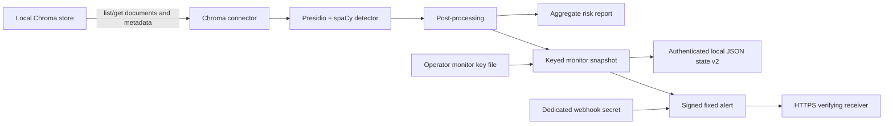

# Architecture

**Baseline context:** this document describes source behavior implemented after `2eddf45e5ff4b66351c2660bb85a34f0107cbd9d` for Issue #10. Independent security review of the exact implementation commit is required before merge. This is an alpha architecture description, not a stability or production-readiness guarantee.

## Implemented now

RAGLeakGuard is a local Python CLI with two commands:

- `ragleakguard scan` reads a local Chroma store, detects sensitive entities, aggregates findings, assigns a risk level, and writes a Markdown report.
- `ragleakguard monitor` repeats the read/detect path, compares a metadata snapshot with prior state, optionally posts a webhook, and returns exit code 1 for new or changed findings.

Python modules are importable, but no separately versioned stable SDK contract is defined.

### Connector

[connectors.py](../src/ragleakguard/connectors.py) implements local Chroma access through `chromadb.PersistentClient`. It lists collections, calls `get(include=["documents", "metadatas"])` once per collection, and yields IDs, documents, metadata, and collection names. The CLI then materializes all yielded items in memory. Detection is applied only to each yielded document's `text`; metadata values are carried by the connector but are not scanned.

The application code calls list/get operations and contains no intended write to the scanned collection. This has not yet been proven against every supported Chroma version or operational side effect. Pagination, resource bounds, cancellation, resumption, and completion evidence are **planned**.

Pinecone is not implemented: an optional dependency and placeholder function exist, but the runtime command rejects every source other than Chroma.

### Detection

[detect.py](../src/ragleakguard/detect.py) builds a cached Microsoft Presidio analyzer using the `en_core_web_sm` spaCy model. Default detection requests global/US entity types. The only implemented optional locale pack is `au`, which adds Medicare, phone, TFN, ABN, and ACN recognizers. TFN/ABN/ACN candidates pass checksum validation; post-processing also applies date/phone validation and overlap suppression.

When the required model is absent, Presidio may attempt to acquire it during analyzer initialization. RAGLeakGuard does not currently override or disable this Presidio behavior. Controlling runtime model acquisition and pinning the exact model artifact and version remain separate residual hardening concerns.

Findings contain entity type, span, confidence score, and the detected text while in process. The current report consumes only aggregated type counts. Callers importing `detect()` receive the finding dictionaries, including detected text, and are responsible for protecting them.

### Risk report

[risk_policy.py](../src/ragleakguard/risk_policy.py) implements the source-controlled `RLG-ID-RISK@1.0.0` contract. Its immutable matrix assigns a severity to every currently requested default/global-US entity and every entity in the implemented `au` locale pack. Import-time validation fails if implemented detector types and the matrix diverge. [report.py](../src/ragleakguard/report.py) consumes aggregate type counts and record counts, applies that policy, and emits Markdown containing the policy identifier/version, level, and ordinal score.

The overall policy retains the inclusive 25% high-impact and 50% prevalence thresholds using exact integer comparisons. Unknown/custom types remain visible as `REVIEW` and are conservatively high-impact for overall classification. Contradictory aggregate counts are rejected rather than scored. Report rows are sorted deterministically; identical aggregate findings, record counts, and policy version produce identical classifications. See the complete [identifier risk policy](RISK_POLICY.md) for the matrix, validation rules, compatibility behavior, and limitations.

Reports created before policy attribution remain legacy unversioned artifacts and are not retroactively assigned the current version. Adding policy attribution and an ordinal score is an additive Markdown-format change; the existing `build_report` positional call shape remains valid. The report still includes aggregate counts plus the configured source and path, and the recommendations remain guidance. RAGLeakGuard does not execute prevention, deletion, or proof operations.

### Monitor state and alerts

[monitor.py](../src/ragleakguard/monitor.py) requires an explicit 256-bit operator key file and an explicitly authorized `--initialize` when no state exists. The key file has a strict monitor purpose, construction identifier, and random non-secret key ID. The generator uses the operating system CSPRNG and never overwrites a path. There is no default/fallback key or hosted key service.

Finding identity is the detector's exact type plus exact detected value. Score and position are deliberately excluded. Typed length-prefixed UTF-8 framing preserves exact code-point distinctions, and sorted repeated finding tokens give order-independent multiset behavior while retaining duplicate multiplicity. Separate labelled HMAC-SHA-256 subkeys produce full 256-bit finding tokens, aggregate fingerprints, store-scope tokens, record-correlation tokens, and state authentication. This detects equal-type/equal-count value replacement unless a residual cryptographic collision occurs.

The strict version-2 JSON checkpoint persists only the construction/key identifiers, a keyed store-scope token, token-keyed records containing finding count/full aggregate fingerprint, consistency totals, and an authenticator over the canonical state body. It omits raw source/store/state paths, collection/tenant names, record IDs, document text, detected values, spans, finding types, key material, and exception text. State loading rejects duplicate/unknown fields, wrong types, out-of-bound or inconsistent counts, invalid digests, corruption/tampering, unsupported versions, key/scope mismatches, and authentication failures before source access or diffing.

Version-1 state is rejected without rewrite because aggregate type/count data cannot be losslessly converted to finding-value history. New baseline creation uses same-directory atomic no-overwrite installation; updates write/fsync a same-directory temporary file and call atomic replacement. Tested temporary-write/replacement failures preserve the prior checkpoint and emit no success/webhook. See the complete [monitor key and state contract](MONITOR_STATE.md) for schema, cryptography, lifecycle, rotation, recovery, compatibility, and limits.

The optional webhook uses a separate, strict 256-bit operator secret and emits only the fixed 60-byte version-1 body `{"event":"ragleakguard.monitor.exposure-change","version":1}`. The sender signs the exact method, normalized authority, origin-form request target, allowlisted HTTP/1.1 headers, timestamp, nonce, and immutable body using the public `RLG-WEBHOOK-HMAC-SHA256-v1` framing. The request builder receives no source, snapshot, delta list, record token, finding type/count, monitor key, state path, or exception object.

Webhook preflight validates the HTTPS URL and dedicated secret before connector access. Alert construction and signing precede checkpoint replacement; the single network attempt follows a successful checkpoint. A raw TLS socket emits exactly the nine protocol headers, never follows redirects, performs ordinary certificate-chain/hostname verification, and applies one 10-second monotonic deadline across DNS, connection, TLS handshake, request writes, and response headers. It reads response headers one byte at a time through the terminator so response-body bytes are not consumed, then accepts only `200..299`.

The public [webhook protocol](WEBHOOK_PROTOCOL.md) includes the test vector and a receiver verifier contract. The included helper authenticates first, applies the inclusive 300-second freshness window, and atomically records `(key_id, nonce)` in a process-local cache. HMAC is authenticity/integrity, not confidentiality or replay prevention by itself. Delivery remains non-durable: there is no outbox, retry/backoff, idempotency guarantee, dead-letter state, crash recovery, or multi-destination routing.

### CLI and failure behavior

[cli.py](../src/ragleakguard/cli.py) provides Typer commands and writes operator messages to the console. Unsupported sources, missing required Chroma paths, malformed or unsupported locales, and an orphan `--webhook-secret-file` exit 2. If detection dependencies or the required spaCy model cannot load, commands exit 3. Monitor key/state, compatibility, fingerprint, and checkpoint failures exit 4. Webhook configuration, secret loading, preparation, transport, redirect, and response failures exit 5 with static messages. Locale/detection and webhook preflight, followed by monitor key/state authentication, complete before source access. Unsigned webhook configuration is rejected. Only an accepted `2xx` prints `Webhook alert delivered.`

## Trust boundaries

- The local vector store and its contents are sensitive input controlled by the operator.
- The local process temporarily handles raw document text and detected values.
- The report path and monitor state are local persistent outputs controlled by the operator.
- The operator monitor key file is a local secret input; its permissions, backup, recovery, rotation, retirement, and scheduled-job access are operator trust boundaries.
- The dedicated webhook secret is a distinct local secret input shared separately with a verifying receiver; it must never be derived from or substituted for the monitor key.
- The HTTPS receiver, TLS endpoint, receiver clock, key-ID mapping, atomic nonce cache, logs, and downstream adapters are separate trust boundaries. The fixed event discloses only that an exposure change occurred, while the endpoint remains observable to network infrastructure.
- Package indexes, dependency downloads, the spaCy model download, and source-control/release systems are supply-chain boundaries.

See the [threat model](THREAT_MODEL.md) for assets, abuse cases, and residual risks.

## Planned, not implemented

The public [roadmap](../ROADMAP.md) tracks possible additional locales, connectors, file scanning, integrations, HTML/compliance reporting, and future Prevent/Fix and Prove stages. Remaining Phase 0 hardening plans include bounded connectors, durable alert delivery, packaged demos, and reproducible releases.

No Prevent/Fix vault, erasure mechanism, signed proof, multi-tenant Control Plane, certification, or hosted service is implemented in this repository.
