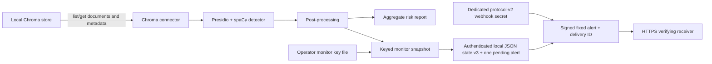

# Architecture

**Baseline:** runtime behavior through Git commit `d33dba52e04923d5e4912d4637ce84d19dd8884f` was independently inspected on 2026-08-10. The durable-outbox additions described below are implemented in this change and remain subject to independent security review before merge. This is an alpha architecture description, not a stability or production-readiness guarantee.

## Implemented now

RAGLeakGuard is a local Python CLI with two commands:

- `ragleakguard scan` reads a local Chroma store, detects sensitive entities, aggregates findings, assigns a risk level, and writes a Markdown report.
- `ragleakguard monitor` repeats the read/detect path, compares a metadata snapshot with prior state, optionally posts a webhook, and returns exit code 1 for new or changed findings.

Python modules are importable, but no separately versioned stable SDK contract is defined.

### Connector

[connectors.py](../src/ragleakguard/connectors.py) implements local Chroma access through `chromadb.PersistentClient`. It lists collections, calls `get(include=["documents", "metadatas"])` once per collection, and yields IDs, documents, metadata, and collection names. The CLI then materializes all yielded items in memory. Detection is applied only to each yielded document's `text`; metadata values are carried by the connector but are not scanned.

The application code calls list/get operations and contains no intended write to the scanned collection. This has not yet been proven against every supported Chroma version or operational side effect. Pagination, resource bounds, cancellation, resumption, and completion evidence are **planned**.

Pinecone is not implemented: an optional dependency and placeholder function exist, but the runtime command rejects every source other than Chroma.

### Detection

[detect.py](../src/ragleakguard/detect.py) builds a cached Microsoft Presidio analyzer using the `en_core_web_sm` spaCy model. Default detection requests global/US entity types. The only implemented optional locale pack is `au`, which adds Medicare, phone, TFN, ABN, and ACN recognizers. TFN/ABN/ACN candidates pass checksum validation; post-processing also applies date/phone validation and overlap suppression.

When the required model is absent, Presidio may attempt to acquire it during analyzer initialization. RAGLeakGuard does not currently override or disable this Presidio behavior. Controlling runtime model acquisition and pinning the exact model artifact and version remain separate residual hardening concerns.

Findings contain entity type, span, confidence score, and the detected text while in process. The current report consumes only aggregated type counts. Callers importing `detect()` receive the finding dictionaries, including detected text, and are responsible for protecting them.

### Risk report

[risk_policy.py](../src/ragleakguard/risk_policy.py) implements the source-controlled `RLG-ID-RISK@1.0.0` contract. Its immutable matrix assigns a severity to every currently requested default/global-US entity and every entity in the implemented `au` locale pack. Import-time validation fails if implemented detector types and the matrix diverge. [report.py](../src/ragleakguard/report.py) consumes aggregate type counts and record counts, applies that policy, and emits Markdown containing the policy identifier/version, level, and ordinal score.

The overall policy retains the inclusive 25% high-impact and 50% prevalence thresholds using exact integer comparisons. Unknown/custom types remain visible as `REVIEW` and are conservatively high-impact for overall classification. Contradictory aggregate counts are rejected rather than scored. Report rows are sorted deterministically; identical aggregate findings, record counts, and policy version produce identical classifications. See the complete [identifier risk policy](RISK_POLICY.md) for the matrix, validation rules, compatibility behavior, and limitations.

Reports created before policy attribution remain legacy unversioned artifacts and are not retroactively assigned the current version. Adding policy attribution and an ordinal score is an additive Markdown-format change; the existing `build_report` positional call shape remains valid. The report still includes aggregate counts plus the configured source and path, and the recommendations remain guidance. RAGLeakGuard does not execute prevention, deletion, or proof operations.

### Monitor state and alerts

[monitor.py](../src/ragleakguard/monitor.py) requires an explicit 256-bit operator key file and an explicitly authorized `--initialize` when no state exists. The key file has a strict monitor purpose, construction identifier, and random non-secret key ID. The generator uses the operating system CSPRNG and never overwrites a path. There is no default/fallback key or hosted key service.

Finding identity is the detector's exact type plus exact detected value. Score and position are deliberately excluded. Typed length-prefixed UTF-8 framing preserves exact code-point distinctions, and sorted repeated finding tokens give order-independent multiset behavior while retaining duplicate multiplicity. Separate labelled HMAC-SHA-256 subkeys produce full 256-bit finding tokens, aggregate fingerprints, store-scope tokens, record-correlation tokens, and state authentication. This detects equal-type/equal-count value replacement unless a residual cryptographic collision occurs.

The strict version-3 JSON state retains the version-2 checkpoint and adds exactly one authenticated `pending_alert`, either `null` or a bounded object containing only the fixed event/version, a random 128-bit delivery ID, completed failed-attempt count, and next retry time. It omits webhook URL/authority, secret/key ID, attempt timestamp/nonce/signature/request bytes, raw source/store/state paths, collection/tenant names, record IDs, document text, detected values, spans, finding types/counts, response data, key material, and exception text. State loading rejects duplicate/unknown fields, wrong types, bounds/count inconsistencies, invalid digests, corruption/tampering, unsupported versions, key/scope mismatch, and authentication failure before source access.

Version-1 state remains rejected without rewrite because aggregate type/count data cannot be losslessly converted. Valid authenticated version-2 state loads as having no pending alert and migrates only on the next successful atomic state transition; migration cannot recover alerts lost under the older ordering. New baseline creation uses same-directory atomic no-overwrite installation; updates write and file-`fsync` a same-directory temporary file before atomic replacement. Failure injection covers serialization, temporary write, `fsync`, replacement, migration, retry updates, and clearing. See the [monitor state contract](MONITOR_STATE.md).

The optional webhook uses a separate protocol-v2 256-bit operator secret and emits only the fixed 60-byte body `{"event":"ragleakguard.monitor.exposure-change","version":2}`. `RLG-WEBHOOK-HMAC-SHA256-v2` signs the exact method, normalized authority, origin-form target, ten allowlisted HTTP/1.1 headers, persisted delivery ID, fresh timestamp/nonce, and immutable body. Legacy v1 secret files/receivers fail closed; provisioning requires a new file and key ID. The request builder receives no source, snapshot, delta, record token, finding type/count, monitor key, state path, or exception object.

Webhook preflight validates the HTTPS URL and v2 secret before connector access. For new exposure, the checkpoint and pending alert are authenticated and atomically replaced before any attempt timestamp, nonce, signature, or request is constructed. A pending alert blocks source access and newer scans. Each due invocation makes at most one attempt using the stable delivery ID and fresh attempt fields. A raw TLS socket never follows redirects, performs ordinary certificate/hostname verification, applies one 10-second monotonic DNS-to-response-header deadline, consumes no response body, and accepts only `200..299`.

Failed attempts retain the same delivery ID and atomically advance a non-zero, CSPRNG full-jitter exponential retry schedule capped at 3600 seconds. No attempt/age rule discards the alert. Accepted `2xx` permits atomic clear; failed clear is ambiguous and can duplicate a later attempt. The [protocol](WEBHOOK_PROTOCOL.md) publishes the exact v2 vector and receiver order: authenticate, freshness, atomic nonce replay rejection, then a durable atomic delivery-ID store that processes unseen IDs and returns duplicate success without reprocessing. The included memory store is test-only. This is not exactly-once delivery; one pending alert, one destination, and no dead-letter administration are implemented.

### CLI and failure behavior

[cli.py](../src/ragleakguard/cli.py) provides Typer commands and static operator messages for the monitor security paths. Usage/locale errors exit 2; detection-runtime failures exit 3; monitor key/state, retry-metadata, and accepted-but-not-cleared failures exit 4; pending/backoff and webhook configuration/preparation/transport/response failures exit 5. A recovered pending alert that is accepted and durably cleared exits 0 without scanning. A current scan with new/changed exposure exits 1 after its required local transition. No webhook acceptance line appears before accepted `2xx` and successful local clear, and it explicitly disclaims downstream processing.

## Trust boundaries

- The local vector store and its contents are sensitive input controlled by the operator.
- The local process temporarily handles raw document text and detected values.
- The report path and monitor state are local persistent outputs controlled by the operator.
- The operator monitor key file is a local secret input; its permissions, backup, recovery, rotation, retirement, and scheduled-job access are operator trust boundaries.
- The dedicated webhook secret is a distinct local secret input shared separately with a verifying receiver; it must never be derived from or substituted for the monitor key.
- The HTTPS receiver, TLS endpoint, receiver clock, key-ID mapping, atomic nonce cache, durable atomic delivery-ID store, processor transaction, logs, and downstream adapters are separate trust boundaries. The fixed event discloses only that an exposure change occurred, while public delivery metadata and the endpoint remain observable to network infrastructure.
- Package indexes, dependency downloads, the spaCy model download, and source-control/release systems are supply-chain boundaries.

See the [threat model](THREAT_MODEL.md) for assets, abuse cases, and residual risks.

## Planned, not implemented

The public [roadmap](../ROADMAP.md) tracks possible additional locales, connectors, file scanning, integrations, HTML/compliance reporting, and future Prevent/Fix and Prove stages. Remaining hardening plans include bounded connectors, outbox administration/multiple destinations, packaged demos, and reproducible releases.

No Prevent/Fix vault, erasure mechanism, signed proof, multi-tenant Control Plane, certification, or hosted service is implemented in this repository.
