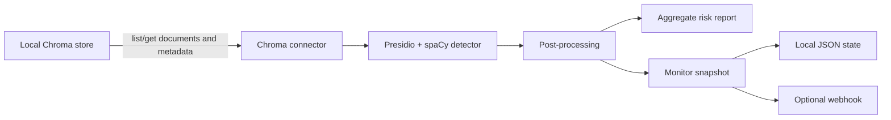

# Architecture

**Baseline:** implemented behavior inspected at Git commit `75fb62766f7324264a6ed08847018a6cac348e8b` on 2026-08-07. This is an alpha architecture description, not a stability or production-readiness guarantee.

## Implemented now

RAGLeakGuard is a local Python CLI with two commands:

- `ragleakguard scan` reads a local Chroma store, detects sensitive entities, aggregates findings, assigns a risk level, and writes a Markdown report.
- `ragleakguard monitor` repeats the read/detect path, compares a metadata snapshot with prior state, optionally posts a webhook, and returns exit code 1 for new or changed findings.

Python modules are importable, but no separately versioned stable SDK contract is defined.

### Connector

[connectors.py](../src/ragleakguard/connectors.py) implements local Chroma access through `chromadb.PersistentClient`. It lists collections, calls `get(include=["documents", "metadatas"])` once per collection, and yields IDs, documents, metadata, and collection names. The CLI then materializes all yielded items in memory. Detection is applied only to each yielded document's `text`; metadata values are carried by the connector but are not scanned.

The application code calls list/get operations and contains no intended write to the scanned collection. This has not yet been proven against every supported Chroma version or operational side effect. Pagination, resource bounds, cancellation, resumption, and completion evidence are **planned**.

Pinecone is not implemented: an optional dependency and placeholder function exist, but the runtime command rejects every source other than Chroma.

### Detection

[detect.py](../src/ragleakguard/detect.py) builds a cached Microsoft Presidio analyzer using the `en_core_web_sm` spaCy model. Default detection requests global/US entity types. The only implemented optional locale pack is `au`, which adds Medicare, phone, TFN, ABN, and ACN recognizers. TFN/ABN/ACN candidates pass checksum validation; post-processing also applies date/phone validation and overlap suppression.

Findings contain entity type, span, confidence score, and the detected text while in process. The current report consumes only aggregated type counts. Callers importing `detect()` receive the finding dictionaries, including detected text, and are responsible for protecting them.

### Risk report

[report.py](../src/ragleakguard/report.py) maps a fixed set of entity types to `HIGH`, `MEDIUM`, or `LOW`, computes one overall level, and emits Markdown. The report includes aggregate counts plus the configured source and path; unknown entity types are labeled `REVIEW`.

The severity map has no policy version and is not exhaustive for every default Presidio type. A versioned, fully tested policy is **planned**. The recommendations in a report are guidance; RAGLeakGuard does not execute prevention, deletion, or proof operations.

### Monitor state and alerts

[monitor.py](../src/ragleakguard/monitor.py) creates one snapshot entry per `collection:id` record key. Each entry stores the number of findings, counts by type, and a truncated SHA-256 digest of the canonical type/count pairs. State is written through a temporary file and `os.replace`.

This detects appearance, disappearance, and type/count changes. It does not detect a sensitive value changing to another value when its types and counts remain equal. The persisted JSON also contains scan time, source, store path, collection names, and record IDs. It does not intentionally store document text, spans, or detected values.

Webhook payloads contain timestamp, source/path, aggregate totals, record keys, and type counts. Delivery is one synchronous unsigned POST with no durable outbox, retry policy, or idempotency key. A finding-level privacy-safe fingerprint and minimized/durable alert contract are **planned**.

### CLI and failure behavior

[cli.py](../src/ragleakguard/cli.py) provides Typer commands and writes operator messages to the console. Unsupported sources and missing required Chroma paths exit 2. Monitor dependency/model failures exit 2. Scan dependency/model failures currently exit 0 without a report, and unsupported locale strings silently add no locale recognizers. Fail-closed behavior is **planned**; current callers must not treat those cases as completed scans.

## Trust boundaries

- The local vector store and its contents are sensitive input controlled by the operator.
- The local process temporarily handles raw document text and detected values.
- The report path and monitor state are local persistent outputs controlled by the operator.
- A webhook crosses the local trust boundary and can disclose the current metadata fields to its receiver.
- Package indexes, dependency downloads, the spaCy model download, and source-control/release systems are supply-chain boundaries.

See the [threat model](THREAT_MODEL.md) for assets, abuse cases, and residual risks.

## Planned, not implemented

The public [roadmap](../ROADMAP.md) tracks possible additional locales, connectors, file scanning, integrations, HTML/compliance reporting, and future Prevent/Fix and Prove stages. Phase 0 hardening also plans fail-closed execution, bounded connectors, a versioned risk policy, privacy-safe finding-level monitoring, webhook minimisation, durable alert delivery, packaged demos, and reproducible releases.

No Prevent/Fix vault, erasure mechanism, signed proof, multi-tenant Control Plane, certification, or hosted service is implemented in this repository.
