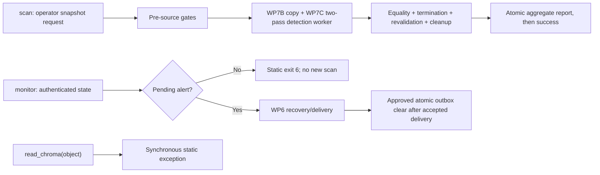

# Architecture

**Baseline:** WP7B's private bounded operator-snapshot confinement foundation passed independent
review at exact implementation head `128decb3e0d78825e884f6dce019898b568c6ba2` and was merged
through [PR #20](https://github.com/Agenvana/RAGLeakGuard/pull/20) as merge commit
`5db765689d35eec8ba918f0f616d5fea34e56955` on 2026-08-13. WP7D adds a bounded public consumer
for exact ChromaDB 1.5.9 and requires independent review of its immutable head. This is an alpha architecture description, not a stability,
production-readiness, connector-completeness, or compliance guarantee.

## Implemented now

RAGLeakGuard is a local Python package and CLI. One aggregate-only Chroma connector accepts a
complete offline snapshot created separately by the operator. Direct/live Chroma and monitor new
scans remain explicit fail-closed boundaries:

Detection, risk-policy, report construction, authenticated monitor-state, and protocol-v2 webhook
modules remain importable. A separately versioned stable Python SDK contract is not defined.

### Direct/live Chroma boundary

[connectors.py](../src/ragleakguard/connectors.py) defines the public
`ChromaConnectorUnavailableError`, the one static disabled message, and a non-generator
`read_chroma()` function. Invocation raises synchronously before Chroma import, path coercion or
inspection, filesystem access, detector initialization, or client construction. It returns no
iterator or scan session.

For `scan`, legacy `--path` is rejected before source access. The only active route requires
`--snapshot`, `--work-parent`, a narrow pseudonymous `--source-id`, and explicit offline/complete
acknowledgement. Locale syntax, detector runtime, strict work-parent validation, and the exact
ChromaDB 1.5.9 platform/Python/native-filesystem gate also precede source access. The same exact
environment tuple is revalidated on the actual WP7B work copy before enumeration.

For `monitor`, source/path and locale usage validation is followed by existing webhook configuration,
monitor-key, state, and scope authentication. A valid pending alert retains WP6 precedence and is
recovered without a new scan. When there is no pending alert, execution exits 6 before detection,
Chroma import, source access, scan-derived state changes, pending-alert creation, webhook request
preparation, or success output.

This preserves existing report and state bytes on disabled paths, leaves absent artifacts absent,
and creates no temporary artifact. Chroma remains outside base dependencies and is available only
through the exact `chroma-snapshot = ["chromadb==1.5.9"]` optional extra.

### Evidence and decision boundary

Executable endpoint evidence established durable mutation with ChromaDB 1.5.0 and 1.5.9: approved
local Rust-client construction could append a durable `acquire_write` row, including on migration
validation failure, and successful reads could change hashes of opaque durable segment files. Other
versions have not established an acceptable read-only boundary.

[Issue #15](https://github.com/Agenvana/RAGLeakGuard/issues/15) was deferred as `not planned`; it
was not completed. WP7D activates only exact 1.5.9 on Linux/ext4 Python 3.10–3.12, macOS 15/APFS
Python 3.12, and Windows/NTFS Python 3.12. ChromaDB 1.5.0 remains private WP7C evidence and is
publicly rejected. No broader supported range or future activation is implied.

### Private snapshot-confinement foundation

[_snapshot.py](../src/ragleakguard/_snapshot.py) implements the private WP7B filesystem lifecycle.
It accepts a directory that the operator represents as a complete, already-created, quiescent
filesystem snapshot; rejects a symlinked root or work parent; inventories only same-device regular
files and directories without following links or reparse points; copies into a new restrictive
RAGLeakGuard-owned workspace; and re-inventories and re-hashes the source and copy before returning a
private held lease. It does not import or construct Chroma.

The lifecycle rejects hard-linked or sparse files, unsupported objects, Windows alternate data
streams, traversal or source/work overlap, observed mutation, insufficient free space, expired
deadlines, cancellation, unsafe permissions, ownership/lease uncertainty, and these hard maxima:

| Bound | Maximum |
|---|---:|
| Source files | 20,000 |
| Source directories, including the root | 10,000 |
| Relative depth | 16 |
| One source file | 16 GiB |
| Aggregate source bytes | 64 GiB |
| Work-copy files, including control files | 21,000 |
| Work-copy bytes, including control files | 72 GiB |
| Copy chunk | 1 MiB |
| Preparation deadline | 1,800 seconds |
| Cleanup/recovery deadline | 600 seconds |

The workspace contains restrictive local key, authenticated owner, authenticated snapshot-phase,
and authenticated lease control files. Cleanup validates resolved containment, the expected
filesystem objects, authenticated ownership, and the held lease before removing anything. Recovery
examines only correctly prefixed direct children of the selected work parent and removes a workspace
only when its ownership documents authenticate and its exclusive lease can be acquired. Static
errors and redacted representations omit source/work paths, file names, contents, and underlying
exception text.

These primitives have no public export. WP7D uses them internally for the active operator-snapshot
connector; `read_chroma()` and new-scan `monitor` remain at the direct/live disabled boundary.
No caller receives the work-copy capability or path.

### Private Chroma candidate enumerator

[_chroma_snapshot.py](../src/ragleakguard/_chroma_snapshot.py) is a private WP7C compatibility and
enumeration layer. It accepts only an exact live WP7B capability, re-authenticates ownership,
containment, ready phase, object identities, and the held lease, and gives Chroma only the
RAGLeakGuard-owned work copy. It never accepts a caller path. Chroma import, local Rust client
construction, and two bounded enumeration passes run in a private child process; the parent proves
child exit before revalidating the store, file effects, capability, and receipt.

WP7B authenticates a keyed digest of the ready work-copy inventory in the in-memory capability.
WP7C must match that digest before starting its worker, so replacement or mutation after readiness
does not silently become the enumeration baseline. For parent-side before/after evidence, WP7C
derives a lease-scoped key from the WP7B authentication key with the
`RLG/WP7C/parent/store-evidence-key/v1` domain. The child generates the operation's sole random
32-byte session key and uses separate domains for collection identity, collection-scoped record
identity, canonical content, and collision witnesses. Neither derived evidence nor session material
is persisted, logged, returned, or sent through IPC. Python cannot guarantee immediate zeroization.

The private evaluation candidates remain exact ChromaDB 1.5.0 and 1.5.9 on the ten-cell WP7C
matrix. Only 1.5.9 is publicly activated through WP7D's narrower five-cell matrix. Complete
migration manifests, explicit local settings, read-only
SQLite preflight, deterministic metadata framing, keyed in-run consistency tokens, pagination,
deadlines, IPC ceilings, environment sanitization, egress denial, and post-exit effect
classification all fail closed. Known dependency writes may occur only in the disposable copy;
logical schema, migration, collection, record, document, or metadata change fails.

The private effect allowlist permits changed bytes only in `chroma.sqlite3` and, beneath an exact
catalogued vector-segment UUID directory, `data_level0.bin`, `header.bin`, `length.bin`,
`link_lists.bin`, or `index_metadata.pickle`. Created or removed paths fail. SQLite byte changes are
accepted only when exact schema and migration evidence plus tenant, database, collection, segment,
record-queue, metadata, full-text, sequence, configuration, and maintenance evidence remains equal
before and after. This describes containment and classification inside the disposable copy, not
source immutability or public compatibility.

The original private WP7C result remains an opaque four-counter receipt. WP7D extends the same
isolated worker with first-pass-only detection for canonical document and metadata segments; the
second pass repeats keyed identity/content/completeness verification without duplicating findings.
Raw documents, metadata, collection names, record IDs, detected values, and paths never cross IPC.
The public result contains only bounded connector counters plus records/segments/UTF-8 bytes,
records with findings, total findings, and validated entity-type counts. Exact counter equality is
required before completion.

WP7D narrows the inherited WP7B/WP7C ceilings to 1,000 collections, 10,000 records, 100,000
canonical detector segments, 268,435,456 detector UTF-8 bytes, 65,536 bytes per segment, 4,096
findings per segment, 1,000,000 total findings, and 64 distinct entity types. Detector aggregate IPC
is at most 16,384 bytes; the final report is at most 1,048,576 bytes; report finalization is bounded
to 30 seconds; the existing worker maximum remains 1,200 seconds; and automatic retries are zero.

### Detection and risk reports

[detect.py](../src/ragleakguard/detect.py) contains the Presidio/spaCy detector. Default library use
requests global/US types; `au` is the only implemented opt-in locale pack. Findings may contain raw
detected text in process, so importing callers are responsible for protecting it. Disabled CLI paths
do not initialize detection.

[risk_policy.py](../src/ragleakguard/risk_policy.py) implements `RLG-ID-RISK@1.0.0`.
[report.py](../src/ragleakguard/report.py) builds deterministic aggregate Markdown reports. WP7D
records only `chroma-snapshot` and the escaped pseudonymous source ID, then uses a restrictive
same-directory temporary file, bounded write, file `fsync`, atomic replacement, and directory
durability where supported. Success follows report finalization. Historical reports remain
unversioned when they lack explicit policy attribution.

### Monitor state and pending-alert recovery

[monitor.py](../src/ragleakguard/monitor.py) retains the authenticated version-3 checkpoint and its
one-entry privacy-minimal pending-alert outbox. Key/scope/state validation still precedes new-scan
disablement. Pending recovery uses the same stable delivery ID with fresh attempt authentication,
bounded retry metadata, HTTPS-only no-redirect transport, and static privacy-safe failure messages.

Only accepted `2xx` response headers permit the approved authenticated atomic transition from an
existing pending alert to `pending_alert: null`. A clear failure remains ambiguous and can cause a
duplicate. Recovery does not access the source or construct any new scan result. See the
[monitor state contract](MONITOR_STATE.md) and [webhook protocol](WEBHOOK_PROTOCOL.md).

### CLI exits

- `0`: a WP7D aggregate report was finalized, credential generation succeeded, or an existing
  pending alert was accepted and durably cleared without a scan.
- `1`: snapshot scan, cleanup, or aggregate-report finalization failed.
- `2`: ordinary CLI source/path/locale, acknowledgement, source-ID, or option-pair usage failure.
- `3`: the detection runtime is unavailable.
- `4`: monitor key/state, retry-metadata, or accepted-but-not-cleared failure.
- `5`: pending configuration/backoff/retry or webhook configuration/preparation/transport/response
  failure.
- `6`: monitor reached the disabled new-scan boundary, or the exact snapshot candidate/activation
  environment is unavailable.

### Corrective release boundary

`0.1.1` is proposed in source but is not published, tagged, or released. Hatch reads
`src/ragleakguard/__init__.py` as the single version source, and executable regression checks require
that value to equal project, wheel, sdist, release-policy, and canonical release-note metadata.
Package metadata is finite at Python `>=3.9,<3.13`.

The non-publishing `release-candidate.yml` workflow checks out one full commit SHA, uses immutable
full-SHA actions and hash-pinned build tools, builds the wheel and sdist once, validates metadata and
archive membership, scans names and bytes for forbidden material and privacy canaries, and uploads
the exact artifacts plus build evidence. Downloaded artifacts—not an editable checkout—are then
tested in the twelve-cell base matrix, private ten-cell WP7C matrix, and unchanged public five-cell
WP7D matrix. Only the final job, which depends on every matrix, can emit the
`ready-for-independent-review` manifest. That status is not publication authorization.

The separate `publish-pypi.yml` workflow is `workflow_dispatch` only and contains no build command.
It accepts dispatch only from the exact reviewed
`Agenvana/RAGLeakGuard/.github/workflows/publish-pypi.yml@refs/tags/v0.1.1` workflow ref, downloads
artifacts from a validated positive candidate run ID, checks the annotated tag and commit, and
revalidates the version and SHA-256 hashes twice. Its pre-existing `pypi` environment must prevent
self-review and allow exactly the `v0.1.1` tag through a tag-only deployment policy, so a modified
workflow on an arbitrary branch cannot reach the environment. Only the final environment-gated job
has `id-token: write`; no username, password, API token, TestPyPI target, or stored publication
secret is defined. The external Trusted Publisher tuple is exactly repository
`Agenvana/RAGLeakGuard`, workflow `publish-pypi.yml`, environment `pypi`; it remains a separate
maintainer-controlled boundary and is not configured by WP8.

## Trust boundaries

- A supplied snapshot/work/report path is sensitive input and must not appear in ordinary output,
  reports, IPC, state, webhooks, or static failures. The direct library path remains argument-opaque.
- Existing report and monitor-state files are sensitive local artifacts and must remain byte-identical
  when a new scan is disabled.
- Monitor keys and webhook secrets remain explicit local secret inputs. Their storage, backup,
  rotation, recovery, and scheduled-job permissions are operator boundaries.
- A pending-alert receiver, TLS endpoint, replay cache, delivery-ID store, logs, and downstream work
  remain separate trust boundaries.
- Package indexes, dependencies, model downloads, source control, and release systems are supply-chain
  boundaries.
- Candidate artifact retention, GitHub runner images, the exact action commits, PyPI-hosted build
  wheels, the spaCy model asset, protected-environment rules, and the external OIDC trust record are
  distinct release-system boundaries. Candidate evidence records hashes and resolved inputs but is
  not a general reproducible-build or supply-chain-compromise guarantee.
- The operator who creates a source snapshot, the local account and administrators that can alter
  it, filesystem semantics, free-space accounting, and process/power-loss behavior are boundaries
  for the WP7B/WP7D lifecycle. The operator—not RAGLeakGuard—must create a complete,
  quiescent/full-filesystem snapshot; the lifecycle does not prove provenance, completeness,
  quiescence, or atomic multi-file consistency.

## Planned or unavailable

General Chroma support, other dependency/platform tuples, direct/live Chroma access, and monitor new
scans remain unavailable. Additional connectors, Prevent/Fix, Prove, Control Plane,
certification, and hosted services are not implemented.
PyPI 0.1.0 contains the unsafe direct path and must not be used for Chroma scanning.
